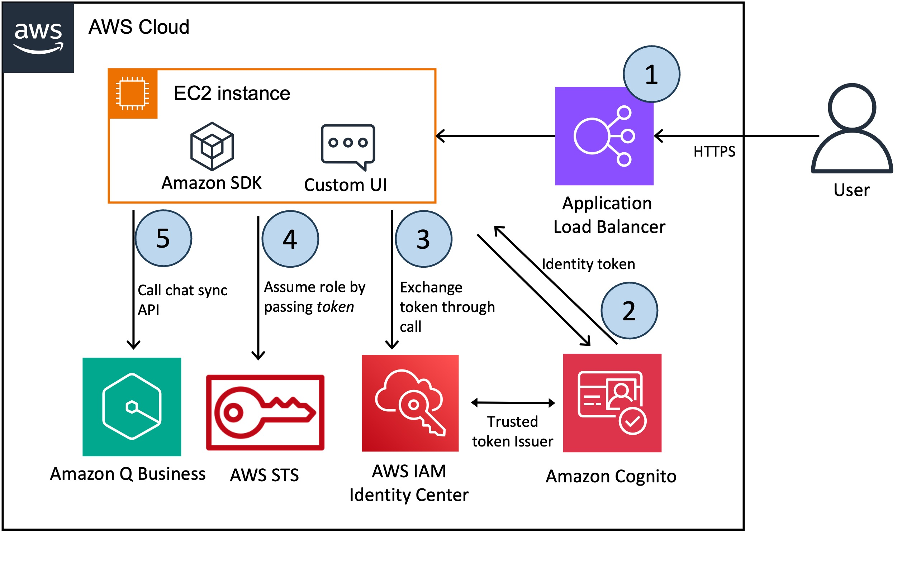

## Fine-Tuning Embedding Models on SageMaker

This repository contains samples for building a custom UI for Amazon Q Business. 

Customers often want the ability to integrate custom functionalities into the Amazon Q user interface, such as handling feedback, using corporate colors and templates, custom login, and reducing context switching by integrating the user interface into a single platform. The code repo will show how to integrate a custom UI on Amazon Q using different identity providers for user authentication and Amazon Q SDK to invoke chatbot application programmatically, through [chat_sync API](https://boto3.amazonaws.com/v1/documentation/api/latest/reference/services/qbusiness/client/chat_sync.html).

## Contents
- `cognito-idp-blog-post/`: This directory contains a sample showing how to integrate a custom UI on Amazon Q using Amazon Cognito as an OAuth-compatible identity provider (IdP), which is required in order to exchange a token with AWS IAM Identity Center and later on interact with the Amazon Q Business APIs.  
The code in this directory is used in the AWS blog post: [Build a custom UI for Amazon Q Business](https://aws.amazon.com/blogs/machine-learning/build-a-custom-ui-for-amazon-q-business/)  

  
## Security
We welcome contributions from the community! If you have an example or sample for building a custom UI for Amazon Q Business, please feel free to submit a pull request. Your contribution will help others in their Generative AI journey.  

See [CONTRIBUTING](CONTRIBUTING.md#security-issue-notifications) for more information.

## License

This library is licensed under the MIT-0 License. See the LICENSE file.

