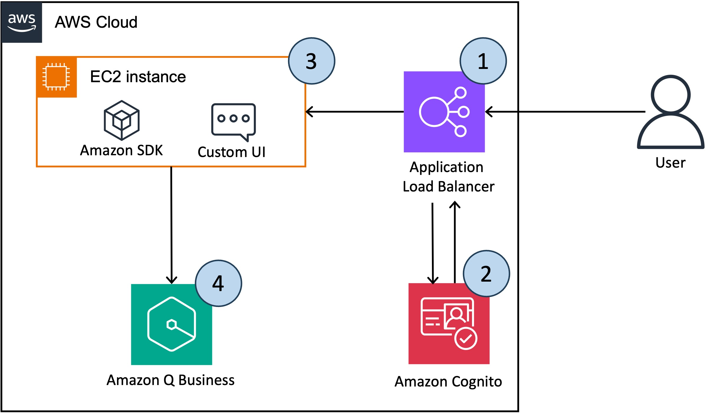
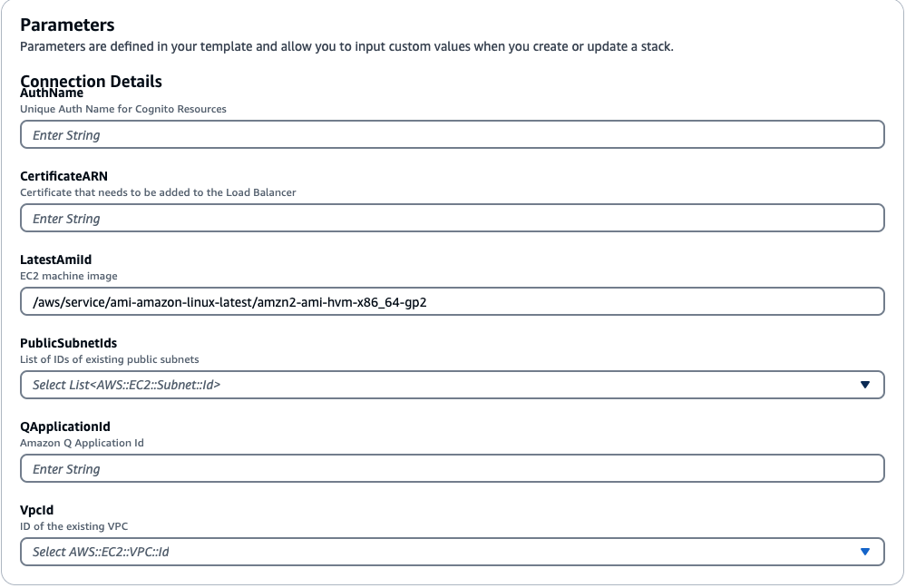
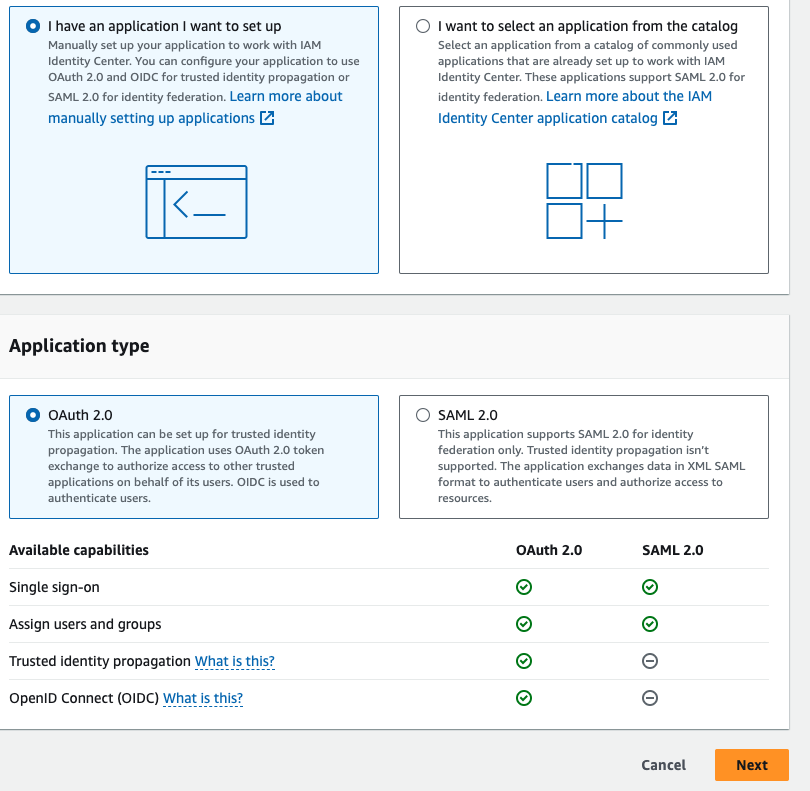
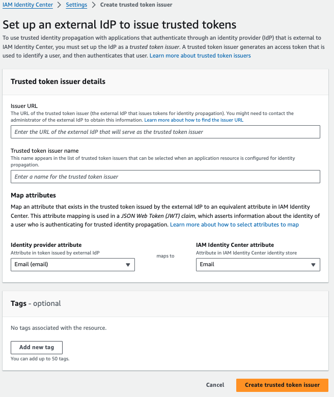
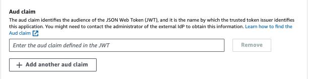
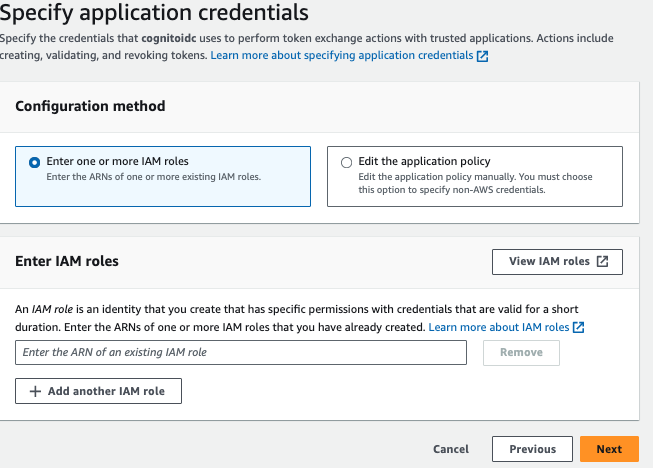
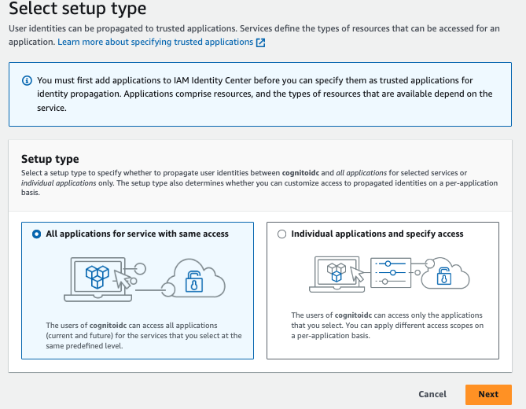
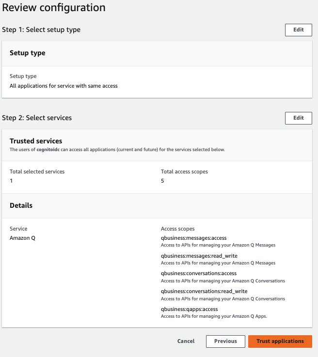

# Custom Web Experience with Amazon Q Business

Customers often want the ability to integrate custom functionalities into the Amazon Q user interface, such as handling feedback, using corporate colors and templates, custom login, and reducing context switching by integrating the user interface into a single platform. The code repo will show how to integrate a custom UI on Amazon Q using Amazon Cognito for user authentication and Amazon Q SDK to invoke chatbot application programmatically.



The workflow includes the following steps:
1.	First the user accesses the chatbot application, which is hosted behind an Application Load Balancer.

2.	On the first log in attempt the user is redirected to the Amazon Cognito log in page for authentication. After successful authentication, the user is redirected back to the chatbot application.

3.	The UI application is deployed on EC2 instance, performs below two actions:

    * The custom UI, parses the token provided by Amazon Cognito and to obtain the user and group information. The Amazon Q chat responses are only generated from the documents that the user and group have access to within an Amazon Q application. The Amazon Q documentation provides more information on how to configure access control list (ACL) for each data source. 
  
    * The user can ask the question in the chat window. The UI sends the userMessage and the Identifier returned from the Amazon Cognito for the user to Amazon Q API.

4.	Amazon Q uses the chat_sync API to carry out the conversation.
	
    *  The request uses the following mandatory parameters

        1.	**applicationId**: The identifier of the Amazon Q application linked to the Amazon	 Q conversation.
      
        2.	**userId**: The identifier of the user attached to the chat input. In our case it will be email Id. Each document in any data source has access control list (ACL) information inherently attached to it as metadata. ACLs contain information about which users and groups have access to a document. When we choose to crawl ACL Amazon Q stores which user IDs have access to a document.
      
        3.	**userMessage**: A end user message in a conversation.
      
        4.	**userGroups[optional]**: The Groups that a user associated with the chat input belongs to. User group information can be fetched from the token after successful authentication and that can be passed to the API to get the relevant documents from Amazon Q.In this post we are not using group information for ACL.
      
    * Amazon Q returns the response as a JSON object (detailed in the  [Amazon Q documentation](https://boto3.amazonaws.com/v1/documentation/api/latest/reference/services/qbusiness/client/chat_sync.html)) and below are the few core attributes from the response payload.
      1.	**systemMessage**: An AI-generated message in a conversation
    
      2.	**sourceAttributions**: The source documents used to generate the conversation response .In the RAG (Retrieval Augmentation Generation) this always refer to one or more documents from enterprise knowledge bases which are indexed in Amazon Q.


## Deploy this solution


### Prerequisites: 
Before you deploy this solution, make sure you have the following prerequisites set up:

- A valid AWS account.
- An AWS Identity and Access Management (IAM) role in the account that has sufficient permissions to create the necessary resources.   
If you have administrator access to the account, no action is necessary.
- An SSL certificate created and imported into AWS Certificate Manager (ACM).   
For more details, [refer to Importing a certificate](https://docs.aws.amazon.com/acm/latest/userguide/import-certificate-api-cli.html).   
If you do not have a public SSL certificate, follow the steps in the next section to learn how to generate a private certificate.
- An existing, working Amazon Q application 
- IAM Identity Center, and create few users in Identity Center by configuring their email address and name

### Generate Private certificate

If you already have an SSL certificate, you can skip this section.   
However, if you don't have one and want to proceed with running this demo, you can generate a private certificate associated with a domain using the following openssl command:
```
openssl req \
  -x509 -nodes -days 365 -sha256 \
  -subj '/C=US/ST=Oregon/L=Portland/CN=sampleexample.com' \
  -newkey rsa:2048 -keyout key.pem -out cert.pem

aws acm import-certificate --certificate fileb://cert.pem --private-key fileb://key.pem
```
Please note that, you will receive a warning from your browser when accessing the UI if you didn't provide a custom SSL certificate when launching the AWS CloudFormation Stack. Above instructions show you 
Please note that you will receive a warning from your browser when accessing the UI if you did not provide a custom SSL certificate when launching the AWS CloudFormation Stack. The above instructions show you how to create a self-signed certificate, which can be used as a backup, but this is certainly not recommended for production use cases.  

You should obtain an SSL Certificate that has been validated by a certificate authority, import it into AWS Certificate Manager, and reference it when launching the AWS CloudFormation Stack.  

If you wish to continue with the self-signed certificate (for development purposes), you should be able to proceed past the browser warning page. With Chrome, you will see a "Your connection is not private" error message (NET::ERR_CERT_AUTHORITY_INVALID), but by clicking on "Advanced," you should then see a link to proceed.


### Deploy this Solution: 

Step 1: Launch the following AWS CloudFormation template to deploy ELB , Cognto User pool , including the EC2 instance to host the webapp.
---------------------------------------------------------------------

Provide the following parameters for stack

•	**Stack name** – The name of the CloudFormation stack (for example, AmazonQ-UI-Demo)

•	**AuthName** – A globally unique name to assign to the Amazon Cognito user pool

•	**CertificateARN** – The CertificateARN generated from the previous step

•	**IdcApplicationArn** – Identity Center customer application ARN , keep it blank on first run as we need to create the cognito user pool as part of this stack to create [IAM Idenity Center application with a trusted token issuer](https://docs.aws.amazon.com/singlesignon/latest/userguide/using-apps-with-trusted-token-issuer.html)

•	**PublicSubnetIds** – The ID of the public subnet that can be used to deploy the EC2 instance and the Application Load Balancer

•	**QApplicationId** – The existing application ID of Amazon Q

•	**VPCId** – The ID of the existing VPC that can be used to deploy the demo





🔗 Once the stack is complete , copy the following Key from the Output tab .
------------------------------------------------

**Audience** : Audience to setup customer application in Identity Center

**RoleArn** : ARN of the IAM role required to setup token exchange in Identity Center

**TrustedIssuerUrl** : Endpoint of the trusted issuer to setup Identity Center

**QServiceRoleNameArn** : IAM role to execute Amazon Q API

**URL** : The Load balancer URL to access the streamlit app


Step 2: Create an IAM Idenity Center Application 
---------------------------------------------------------------------

- Navigate to AWS IAM Identity Center, and add a new custom managed application.

  **Select application type** -> then select OAuth2.0 -> Next

  

- Provide an application name and description and select the below option as shown in the  image


-  Now create a trusted token issuer 


- In the Issuer URL  -> provide the ***TrustedIssuerUrl*** from Step 1,provide an issuer name and keep the map attributes as Email




- Then navigate back to IAM Identity Center application authentication settings , select the trusted token issuer created in the previous step[refresh it if you don't see in the list] and add the Aud claim -> provide the ***Audience*** from step 1 , then click Next

 

- In Specify application credentials ,  Enter IAM roles -> provide ***RoleArn*** from Step 1

 

 - Then Review all the steps and create the application.

 - Once the application is created, go to the application and -> Assigned users and groups .


 - Then set up the Trusted application for identity propagation , follow the below stpes to Amazon Q as Trusted applications for identity propagation






Step 4: Once the IAM Identity Center application is created, copy the Application ARN and navigate to cloudformation to update the stack . Enter the Application ARN in parameter and run the stack
---------------------------------------------------------------------


Step 5 : Once the update is complete , navigate to Cloudformation output tab copy the URL and open the URL in a browser
---------------------------------------------------------------------

Step 6 : Streamlit app will prompt to **Connect with Cognito** , For the first login attempt try to Sign up , use the same email id and password for the user that is already exist in IAM Identity Center.
---------------------------------------------------------------------

⚡ For a better user onboarding experience we can follow the below link to create a second custom app (SAML) in Identity Center to act as the Identity Provider for the Cognito User Pool,removing the need to povision users in both Cognito User Pool and Identity Center.

[Video](https://www.youtube.com/watch?v=c-hpNhVGnj0&t=522s)

[Instructions](https://repost.aws/knowledge-center/cognito-user-pool-iam-integration)


Connect to the EC2 through AWS Session Manager[Optional]: 
---------------------------------------------------------------------

```
sudo su ec2-user
cd /home/ec2-user
ls
cd custom-web-experience-with-amazon-q-business/core
```

## Security

See [CONTRIBUTING](CONTRIBUTING.md#security-issue-notifications) for more information.

## License

This library is licensed under the MIT-0 License. See the LICENSE file.


